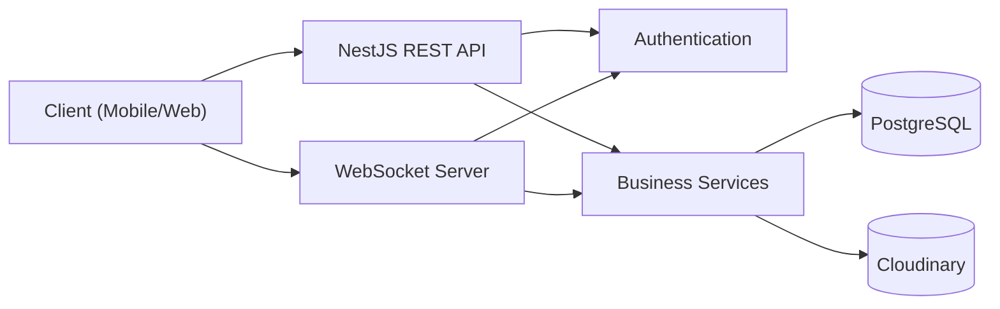
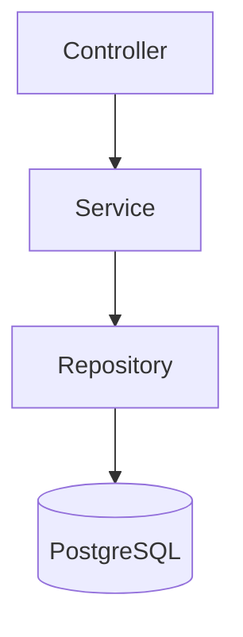
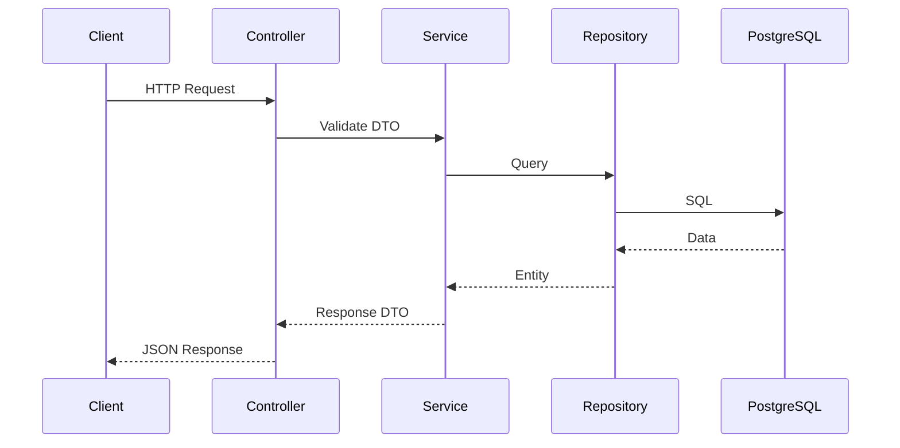
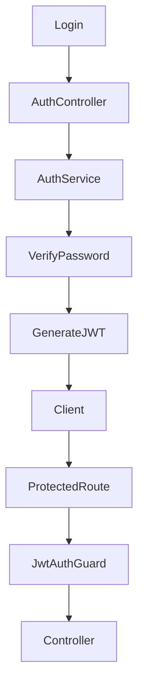
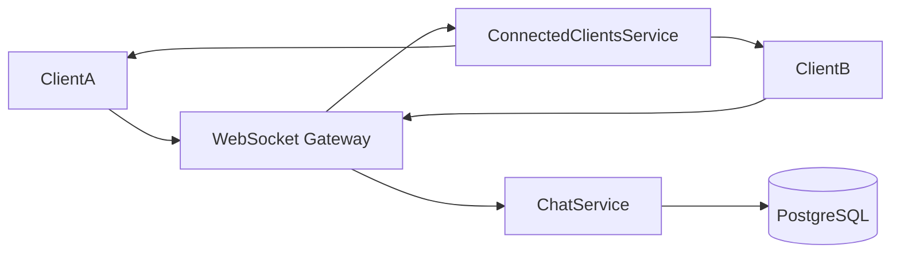
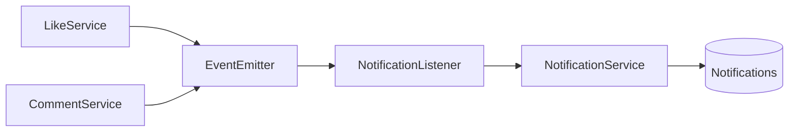
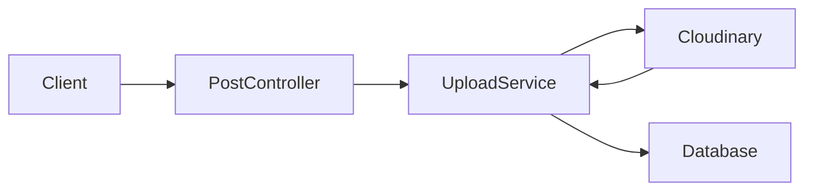

# System Architecture

This document explains the architectural decisions behind the **Versity Blend Backend**, including module interactions, request lifecycle, authentication, real-time communication, and event-driven notifications.

---

# Table of Contents

- Overview
- High-Level Architecture
- Request Lifecycle
- Module Structure
- Authentication Flow
- WebSocket Architecture
- Notification Architecture
- Database Architecture
- File Upload Flow
- Design Principles
- Scalability

---

# Overview

Versity Blend follows a **modular layered architecture** using NestJS.

Business logic is organized into isolated feature modules, each responsible for a single domain of the application.

The backend exposes:

- REST APIs
- WebSocket Services
- Event-driven Notifications

All modules communicate through clearly defined service boundaries.

---

# High-Level Architecture



---

# Backend Layers



Each layer has a single responsibility.

| Layer | Responsibility |
|---------|----------------|
| Controller | Accept HTTP Requests |
| Service | Business Logic |
| Repository | Database Access |
| Database | Persistent Storage |

---

# Request Lifecycle



---

# Project Modules

```text
src
│
├── admin
├── auth
├── chat
├── comments
├── config
├── election
├── groups
├── likes
├── notifications
├── posts
├── realtime
├── types
├── universities
├── upload
└── user
```

Each module encapsulates:

- Controller
- Service
- DTOs
- Entities
- Business Logic

This minimizes coupling and improves maintainability.

---

# Authentication Flow



Authentication is based on JWT.

Passwords are securely hashed using **bcrypt** before storage.

---

# WebSocket Architecture

Unlike many projects that rely on Socket.IO, Versity Blend uses the native **ws** package.



The `ConnectedClientsService` maintains active user connections and enables direct communication between authenticated clients.

---

# Notification Architecture

Notifications follow an **event-driven** approach.

Instead of directly creating notifications inside feature modules, business events are emitted and processed independently.



Benefits:

- Loose coupling
- Easier testing
- Independent business modules
- Better scalability

---

# File Upload Flow



Media files are uploaded to Cloudinary, allowing the backend to remain stateless.

---

# Database Architecture

The application uses PostgreSQL with TypeORM.

Core entities include:

- User
- University
- Group
- Post
- Comment
- Like
- Conversation
- Message
- Notification

Relationships are implemented using:

- OneToMany
- ManyToOne
- ManyToMany

---

# Design Principles

The backend follows several software engineering principles.

## Separation of Concerns

Each module owns its own business logic.

---

## Dependency Injection

NestJS Dependency Injection is used throughout the application.

---

## Layered Architecture

Controllers never access the database directly.

All business logic resides inside services.

---

## Event-Driven Communication

Modules communicate through events whenever possible instead of tight coupling.

---

## Stateless API

Application state is stored in PostgreSQL.

Uploaded files are stored externally using Cloudinary.

---

# Scalability Considerations

Current architecture supports future enhancements including:

- Redis caching
- Horizontal scaling
- Multiple WebSocket instances
- Background workers
- Message queues
- Docker deployment
- Kubernetes orchestration

The modular architecture allows individual domains to evolve independently without affecting the rest of the application.

---

# Future Improvements

- Distributed WebSocket communication using Redis Pub/Sub
- CQRS for complex business domains
- Event sourcing
- API versioning
- Distributed caching
- Monitoring and observability
- Rate limiting
- CI/CD pipeline