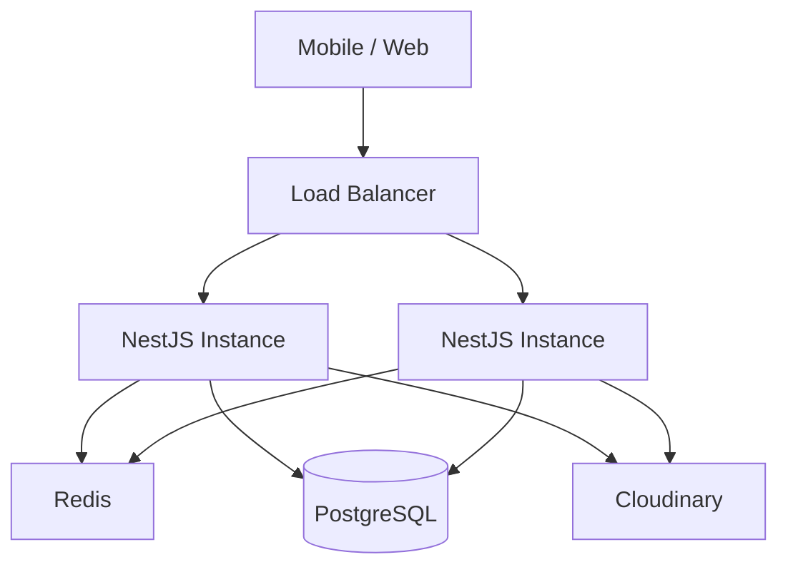
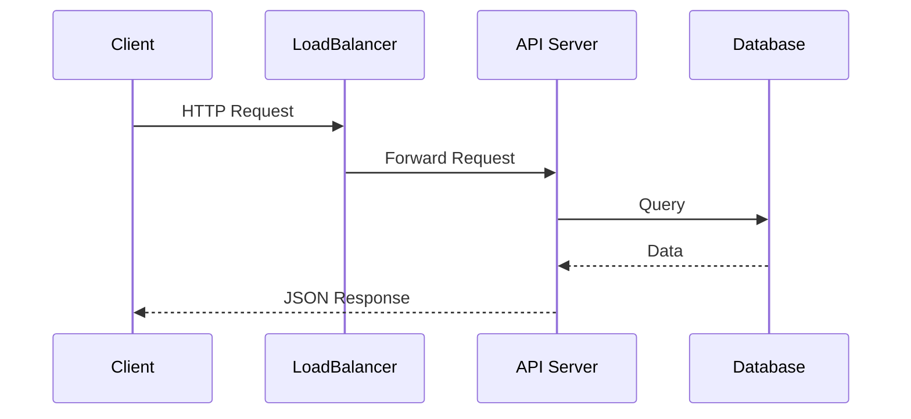
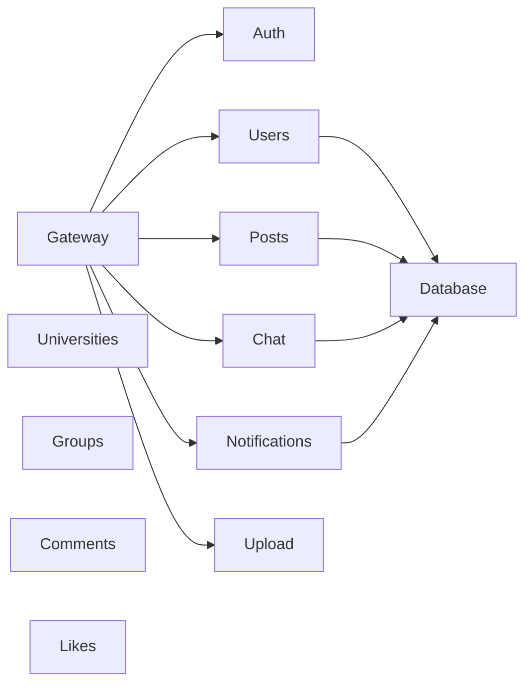
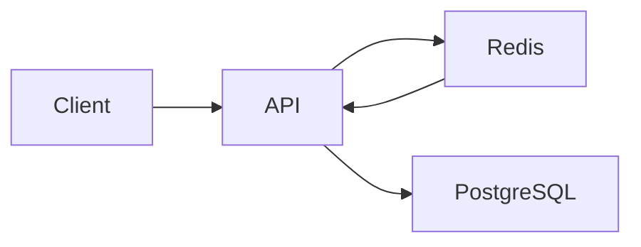

# System Design

This document describes how **Versity Blend Backend** can evolve from its current implementation into a scalable, production-ready backend capable of serving thousands or even millions of users.

---

# Table of Contents

- Goals
- Functional Requirements
- Non-Functional Requirements
- High-Level System Design
- Service Architecture
- Database Design
- Caching Strategy
- File Storage
- Authentication
- Real-Time Messaging
- Notification System
- Scaling Strategy
- Performance Optimizations
- Deployment
- Monitoring
- Disaster Recovery
- Future Improvements

---

# Goals

Versity Blend is designed to become a scalable social networking platform for university students.

The backend should support:

- User authentication
- University communities
- Posts
- Comments
- Likes
- Groups
- Messaging
- Notifications
- File uploads

while remaining highly available and maintainable.

---

# Functional Requirements

## User

- Register
- Login
- Update profile

## Social

- Create posts
- Like posts
- Comment on posts

## Messaging

- One-to-one chat
- Group chat
- Real-time delivery

## Notifications

- Like notification
- Comment notification
- Message notification

---

# Non-Functional Requirements

- High Availability
- Horizontal Scalability
- Low Latency
- Fault Tolerance
- Stateless Services
- Secure Authentication
- Easy Deployment

---

# High-Level Architecture



The application is horizontally scalable because backend instances remain stateless.

---

# Request Flow



---

# Service Architecture



Each module owns its own business logic.

---

# Authentication

Authentication uses JWT.

```text
Login

↓

Validate Credentials

↓

Generate JWT

↓

Return Token

↓

Protected Endpoints
```

Future improvements:

- Refresh Tokens

- OAuth

- Multi-factor Authentication

---

# Database Design

Current Database:

PostgreSQL

Reasons:

- ACID Transactions
- Strong Relations
- Mature Ecosystem
- TypeORM Support

---

# Entity Relationships

```text
University

↓

Users

↓

Posts

↓

Comments

↓

Likes

↓

Notifications
```

Messaging uses:

```
Conversation

↓

Messages
```

---

# Caching Strategy

Frequently accessed data should be cached using Redis.

Examples:

- User Profiles
- Universities
- Feed
- Notifications



Benefits:

- Lower latency

- Reduced database load

- Faster response times

---

# File Storage

Images should never be stored on the backend server.

Current implementation uses Cloudinary.

```text
Client

↓

Upload Service

↓

Cloudinary

↓

Image URL

↓

Database
```

---

# Real-Time Messaging

Current implementation uses WebSockets.

Future scalable architecture:

```mermaid
flowchart TD

Client A

Client B

Gateway 1

Gateway 2

Redis Pub/Sub

Database

Client A --> Gateway 1

Client B --> Gateway 2

Gateway 1 --> Redis Pub/Sub

Gateway 2 --> Redis Pub/Sub

Gateway 1 --> Database

Gateway 2 --> Database
```

Redis Pub/Sub allows messages to be shared across multiple WebSocket servers.

---

# Notification Pipeline

Current:

Like

↓

Notification

Future:

```mermaid
flowchart LR

Like Service

Comment Service

Message Service

Event Bus

Notification Worker

Database

Push Notification Service

Like Service --> Event Bus

Comment Service --> Event Bus

Message Service --> Event Bus

Event Bus --> Notification Worker

Notification Worker --> Database

Notification Worker --> Push Notification Service
```

Using asynchronous workers prevents request delays.

---

# Performance Optimizations

## Pagination

Avoid loading thousands of records.

Use cursor-based pagination.

---

## Indexing

Indexes should exist on:

- email
- university_id
- created_at
- conversation_id
- post_id

---

## Lazy Loading

Load related entities only when needed.

---

## Query Optimization

Avoid N+1 queries.

Use joins where appropriate.

---

# Security

Implemented:

- JWT
- Password Hashing
- DTO Validation

Recommended:

- Helmet
- Rate Limiting
- CSRF Protection
- Input Sanitization
- Audit Logs

---

# Deployment

```mermaid
flowchart TD

GitHub

CI

Docker

Kubernetes

Load Balancer

NestJS Pods

PostgreSQL

Redis

Cloudinary

GitHub --> CI

CI --> Docker

Docker --> Kubernetes

Kubernetes --> Load Balancer

Load Balancer --> NestJS Pods

NestJS Pods --> PostgreSQL

NestJS Pods --> Redis

NestJS Pods --> Cloudinary
```

---

# Monitoring

Recommended Stack

- Prometheus

- Grafana

- Loki

- Sentry

Metrics:

- API Latency

- Error Rate

- Database Connections

- Memory Usage

- CPU Usage

- WebSocket Connections

---

# Disaster Recovery

Recommended:

- Daily Database Backups

- Point-in-Time Recovery

- Cloud Storage Backups

- Multiple Application Instances

---

# Future Improvements

- Microservices

- CQRS

- Event Sourcing

- Kafka

- Elasticsearch

- Redis Streams

- GraphQL

- CDN

- Multi-region Deployment

- Push Notifications

- AI-powered Feed Ranking

---

# Design Philosophy

Versity Blend is intentionally built using a modular monolithic architecture.

This architecture keeps development simple while allowing future migration to distributed services when business requirements justify the added complexity.

The current design emphasizes:

- Maintainability

- Scalability

- Separation of Concerns

- Testability

- Production Readiness